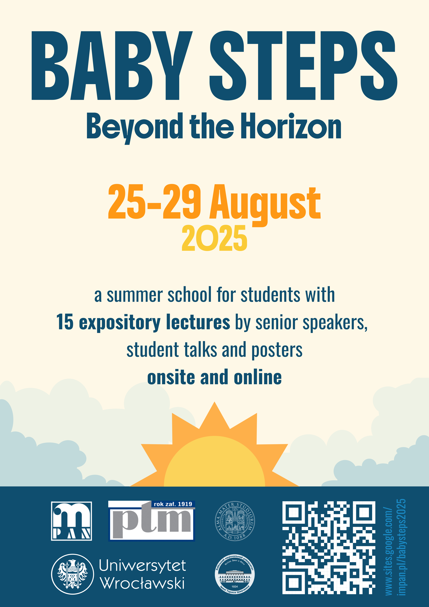

Serdecznie zapraszamy na Letnią Szkołę Matematyczną Baby Steps Beyond the Horizon, wyjątkowe wydarzenie dla studentów matematyki, którzy chcą poszerzyć swoją wiedzę i wymienić się doświadczeniami w inspirującym środowisku akademickim!

📅 **Termin**: 25-29 sierpnia 2025

📍 **Miejsce**: pałac Będlewo oraz Online

🎓 **Dla kogo?** Dla studentów matematyki i pokrewnych kierunków – zarówno licencjackich, jak i magisterskich.

## Co na Was czeka?
✅ 15 wykładów prowadzonych przez doświadczonych prelegentów.

✅ Sesje referatowe i posterowe – doskonała okazja do zaprezentowania własnych badań.

✅ Dyskusje i networking w gronie pasjonatów matematyki.

Nie przegap okazji, aby zgłębić fascynujące zagadnienia matematyczne i nawiązać cenne kontakty!

📌 **Termin zgłoszeń**: 1 czerwca - 31 lipca 2025

🔗 **Więcej informacji i rejestracja**: [https://sites.google.com/impan.pl/babysteps2025/home-page](https://sites.google.com/impan.pl/babysteps2025/home-page)

Do zobaczenia! 🎉

