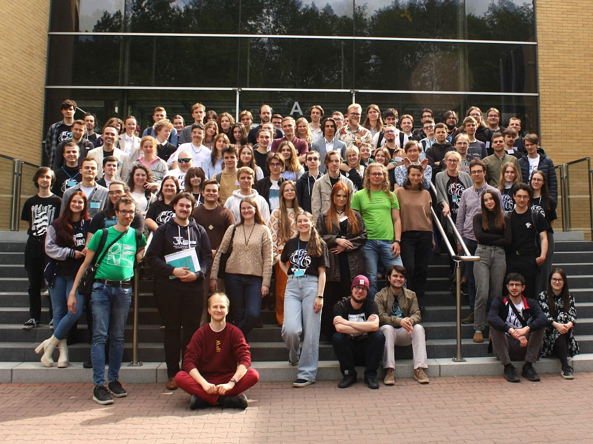

9-11 maja 2025 na Uniwersytecie im. Adama Mickiewicza w Poznaniu odbyła się konferencja "Oblicze".

Prezentowaliśmy KNMT wygłaszając referaty:

- Michał Mądrala - Zastosowanie teorii modeli - 17. problem Hilberta,
- Monika Brattig - Matematyka tasowania kart: o czasie mieszania i stacjonarności łańcuchów Markowa,
- Piotr Held - W świecie dziwnych "metryk",
- Marta Kosz - Teoria Kategorii, czyli sztuka abstrakcyjnego nonsensu,
- Olaf Jankowski-Pluntke - Topologia dla gęstych, czyli trochę o topologii gęstościowej.

Mieliśmy też okazję do uczestniczenia w wykładzie, sesji plakatowej i referatach naszych matematycznych znajomych z całej Polski, jak również do zjedzenia prawie wszystkich jabłek podczas przerw kawowych.

Do zobaczenia za rok!

